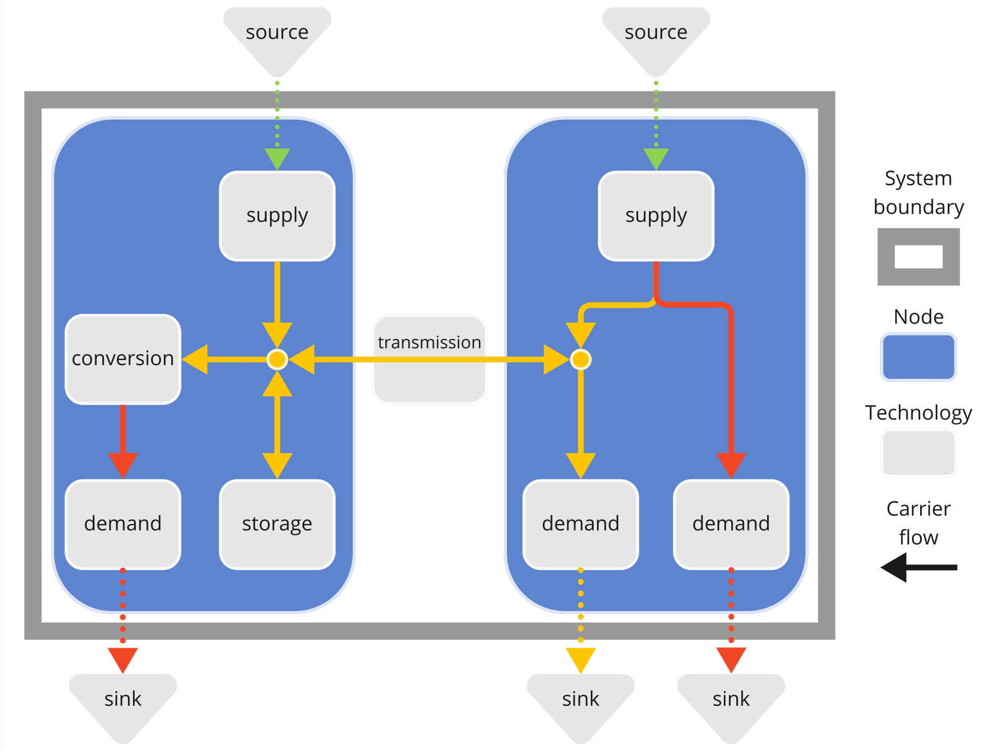

# Creating a model

A Calliope model is a collection of interconnected technologies, nodes and carriers describing a real world system of flows.
Usually, we consider those to be _energy_ flows, and most of what you will read in this documentation concerns energy systems.
However, it is just as applicable to other types of flows, such as water!

**Carriers** are commodities whose flows we track, e.g., electricity, heat, hydrogen, water, CO<sub>2</sub>.

**Technologies** supply, consume, convert, store or transmit _carriers_, e.g., transmission lines/pipes, batteries, power plants, wind turbines, or home appliances.

**Nodes** contain groups of _technologies_ and are usually geographic, e.g., a country, municipality or a single house.

Flows can enter the system from **Sources**, e.g., energy from the sun to power a solar panel, and can exit it into **Sinks**, e.g., electricity consumed by household appliances.
Unlike _carriers_, we do not explicitly track the type of commodity described by sources and sinks.

Putting all of these possibilities together allows a modeller to create a model that is as simple or complex as necessary to answer a given research question.
Calliope's syntax ensures these models are intuitive, and easy to understand and share.



!!! example
    Refer to the [examples and tutorials section](../examples/index.md) for a more practical look at how to build a Calliope model.

## Model configuration and model definition

Calliope models are defined through [YAML](yaml.md) files (a format that is both human and computer-readable), and CSV files (a simple tabular format).
In the pages in this section we will take you through each part of setting up your model.

We distinguish between:

- the model **configuration** (the options provided to Calliope to do its work) and
- the model **definition** (your representation of a physical system in YAML).

Model configuration is everything under the top-level YAML key [`config`](config.md).
Model definition is everything else, under the top-level YAML keys [`parameters`](parameters.md), [`techs`](techs.md), [`nodes`](nodes.md), [`templates`](templates.md), and [`data_tables`](data_tables.md).

It is possible to define alternatives to the model configuration/definition that you can refer to when you initialise your model.
These are defined under the top-level YAML keys [`scenarios` and `overrides`](scenarios.md).

We dive into each of these top-level keys in the pages you'll find in the left-hand navigation.

## Structuring your model directory

It makes sense to collect all files belonging to a model inside a single model directory.
The layout of that directory typically looks roughly like this (`+` denotes directories, `-` files):

```
+ example_model
    + model_definition
        - nodes.yaml
        - techs.yaml
    + data_tables
        - solar_resource.csv
        - electricity_demand.csv
    - model.yaml
    - scenarios.yaml
```

In the above example, the files `model.yaml`, `nodes.yaml` and `techs.yaml` together are the model definition.
This definition could be in one file, but it is more readable when split into multiple.
We use the above layout in the example models.

Inside the `data_tables` directory, tabular data are stored as CSV files.

!!! note
    The easiest way to create a new model is to use the `calliope new` command, which makes a copy of one of the built-in examples models:

    ```shell
    $ calliope new my_new_model
    ```

    This creates a new directory, `my_new_model`, in the current working directory.

    By default, `calliope new` uses the national-scale example model as a template.
    To use a different template, you can specify the example model to use, e.g.: `--template=urban_scale`.

## Next steps to setting up your model

The rest of this section discusses everything you need to know to set up a model:

- An overview of [YAML as it is used in Calliope](yaml.md) - though this comes first here, you can also safely skip it and refer back to it as a reference as questions arise when you go through the model configuration and definition examples.
- More details on the [model configuration](config.md).
- The key parts of the model definition, first, the [technologies](techs.md), then, the [nodes](nodes.md), the locations in space where technologies can be placed.
- How to use [technology and node templates](templates.md) to reduce repetition in the model definition.
- Other important features to be aware of when defining your model: defining [indexed parameters](parameters.md), i.e. parameter which are not indexed over technologies and nodes, [loading tabular data](data_tables.md), and defining [scenarios and overrides](scenarios.md).
