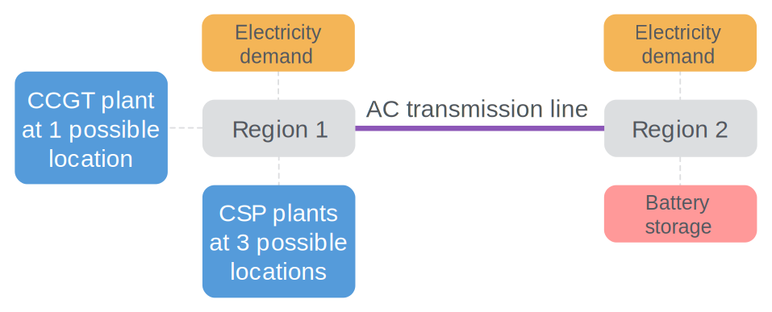
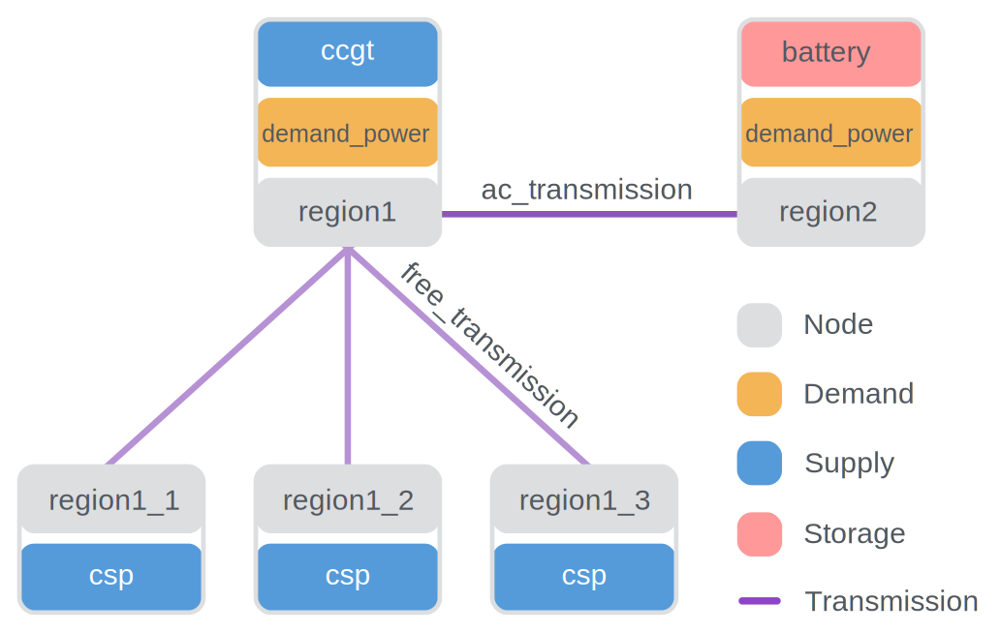

# National Scale Example Model

This example consists of two possible power supply technologies,
a power demand at two nodes,
the possibility for battery storage at one of the nodes,
and a transmission technology linking the two.

The diagram below gives an overview:

<figure>

<figcaption>National scale example model overview</figcaption>
</figure>

We distinguish between model _configuration_ (the options provided to Calliope to do its work) and the model _definition_ (your representation of a physical system in YAML).


## Model configuration

The model configuration file `model.yaml` is the place to tell Calliope about how to interpret the model definition and how to build and solve your model.
It does not contain much data, but the scaffolding with which to construct and run your model.


```yaml
--8<-- "src/calliope/example_models/national_scale/model.yaml:config"
```

## Model definition

### Top-level parameters

Before we dive into the technologies and nodes in the model, we have defined some parameters that are independent of both of these:

```yaml
--8<-- "src/calliope/example_models/national_scale/model.yaml:parameters"
```

Neither of these parameters is strictly necessary to define.
They have defaults assigned to them (see the model definition schema in the `reference` section of the documentation).
However, we have included them in here as examples.

`objective_cost_weights` can be used to weight different cost classes in the objective function
(e.g., if we had `co2_emissions` as well as `monetary` costs).
`bigM` (see ["Big M method" on Wikipedia](https://en.wikipedia.org/wiki/Big_M_method)) is used to formulate certain types of constraints and should be a large number,
but not so large that it causes numerical trouble.

`bigM` is dimensionless, while `objective_cost_weights` is indexed over the `costs` dimension.
You will see this same `parameter` definition structure elsewhere in the model definition as we index certain parameters over other dimensions.

### Supply technologies

The example model defines two power supply technologies.

The first is `ccgt` (combined-cycle gas turbine), which serves as an example of a simple technology with an infinite source.
Its only constraints are the cost of built capacity (`flow_cap`) and a constraint on its maximum built capacity.

<figure>

<figcaption>The layout of a supply technology which has an infinite source, a carrier conversion efficiency ($flow_{eff}^{out}$),
and a constraint on its maximum built $flow_{cap}$ (which puts an upper limit on $flow_{out}$).</figcaption>
</figure>

The definition of this technology in the example model's configuration looks as follows

```yaml
--8<-- "src/calliope/example_models/national_scale/model_config/techs.yaml:ccgt"
```

There are a few things to note.
First, `ccgt` defines essential information:
a name, a color (given as an HTML color code, for later visualisation), its base_tech, `supply`, and its carrier_out, `power`.
It has set itself up as a power supply technology.
This is followed by the definition of parameters to use to constrain the technology's contribution to the system and costs.

!!! note
    There are technically no restrictions on the units used in model definitions.
    Usually, the units will be kW and kWh, alongside a currency like USD or EUR for costs.
    There is nothing preventing the use of other units, but yt is the responsibility of the modeler to ensure that units are correct and consistent.

The second technology is `csp` (concentrating solar power), and serves as an example of a complex supply technology making use of:

* a finite source based on time series data
* inbuilt storage
* plant-internal losses (`parasitic_eff`)

<figure>

<figcaption>The layout of a supply technology which makes use of a storage buffer and parasitic efficiency.</figcaption>
</figure>

This definition in the example model's configuration is more verbose:

```yaml
--8<-- "src/calliope/example_models/national_scale/model_config/techs.yaml:csp"
```

Again, `csp` has the definitions for name, color, base_tech, and carrier_out.
Its constraining parameters are more numerous, it defines:

* a maximum storage capacity (`storage_cap_max`)
* an hourly storage loss rate (`storage_loss`),
* a constraint that flow capacity can be no greater than storage capacity (`flow_cap_per_storage_cap_max`).

It also defines a carrier conversion efficiency of 0.4 and a parasitic efficiency of 0.9 (i.e., an internal loss of 0.1).
Finally, the source collector area and the installed carrier conversion capacity are constrained to a maximum.

The costs are more numerous as well, and include monetary costs for all relevant components along the conversion from source to carrier (power):

* storage capacity
* source collector area
* source conversion capacity
* carrier conversion capacity
* variable operational and maintenance costs

### :sparkles: Interlude: inheriting from technology groups

You will notice that the above technologies _inherit_ `cost_dim_setter`.
Inheritance allows us to avoid excessive repetition in our model definition.
In this case, `cost_dim_setter` defines the dimension and index of costs, allowing us to keep our definition of technology costs to only defining `data`.
By defining `data`, the technologies override the `null` setting applied by `cost_dim_setter`.
We also use it to set the `interest_rate` for all technologies, which will be used to annualise any investment costs each technology defines.

Technologies can inherit from anything defined in `tech_groups`, while nodes can inherit from anything in `node_groups`.
items in `[tech/node]_groups` can also inherit from each other, so you can create inheritance chains.

`cost_dim_setter` looks like this:

```yaml
--8<-- "src/calliope/example_models/national_scale/model_config/techs.yaml:cost-dim-setter"
```

### Storage technologies

The second location allows a limited amount of battery storage to be deployed to better balance the system.

This technology is defined as follows:

<figure>

<figcaption>A storage node with $flow_{eff}^{in}$, $flow_{eff}^{out}$, and $storage_{loss}$.</figcaption>
</figure>

```yaml
--8<-- "src/calliope/example_models/national_scale/model_config/techs.yaml:battery"
```

The constraints give a maximum installed generation capacity for battery storage.
This is combined with a maximum ratio of flow capacity to storage capacity (`flow_cap_per_storage_cap_max`),
which effectively limits the storage capacity.
The ratio is the charge/discharge rate / storage capacity (a.k.a the battery `reservoir`).
In the case of a storage technology, `flow_in_eff` applies on charging and `flow_out_eff` on discharging.
In addition, storage technologies can lose stored carrier over time - in this case, we set this loss to zero.

### Other technologies

Three more technologies are needed for a simple model.

First, a definition of power demand:

<figure>

<figcaption>A demand technology, directing a $flow_{in}$ to a sink outside the system boundary.</figcaption>
</figure>

Power demand is a technology like any other.
We will associate an actual demand time series with the demand technology at each [node](#nodes) separately.

```yaml
--8<-- "src/calliope/example_models/national_scale/model_config/techs.yaml:demand"
```

What remains to set up is a simple transmission technology.
Transmission technologies look different to other technologies, as they link the carrier at one location to the carrier at another:

<figure>

<figcaption>A transmission technology with the options for flow efficiency ($flow_{eff}^{out}$ and $flow_{eff}^{in}$) and flow capacity ($flow_{cap}$).</figcaption>
</figure>

```yaml
--8<-- "src/calliope/example_models/national_scale/model_config/techs.yaml:transmission"
```

`ac_transmission` has an efficiency of 0.85, so a loss during transmission of 0.15, as well as some cost definitions.

`free_transmission` allows local power transmission from any of the csp facilities to the nearest location.
As the name suggests, it applies no cost or efficiency losses to this transmission.

We can see that those technologies which rely on `free_transmission` inherit a lot of this information from elsewhere in the model definition.
`free_transmission` is defined in `tech_groups`, which makes it inheritable.

```yaml
--8<-- "src/calliope/example_models/national_scale/model_config/techs.yaml:free-transmission"
```

### Nodes

In order to translate the model requirements shown in this section's introduction into a model definition, five nodes are used: `region1`, `region2`, `region1_1`, `region1_2`, and `region1_3`.

The technologies are set up at these nodes as follows:

<figure>

<figcaption>Nodes and their technologies in the example model.</figcaption>
</figure>

Locations and their technologies in the example model

Let's now look at the first location definition:

```yaml
--8<-- "src/calliope/example_models/national_scale/model_config/locations.yaml:region-1"
```

There are several things to note here:

* The node specifies a dictionary of technologies that it allows (`techs`),
with each key of the dictionary referring to the name of technologies defined in our `techs.yaml` file.
The technologies listed here must have been defined under the `techs` key.
* It also overrides some options for both `demand_power` and `ccgt`.
For `ccgt`, it simply sets a node-specific maximum capacity constraint.
For `demand_power`, the options set here are related to reading the demand time series from a CSV file.
CSV is a simple text-based format that stores tables by comma-separated rows.
Note that we did not define any `sink` option in the definition of the `demand_power` technology.
Instead, this is done directly via a node-specific override.
For this node, the file `demand-1.csv` is loaded and the column `demand` is taken (the text after the colon).
If no column is specified, Calliope will assume that the column name matches the location name `region1`.
* Coordinates are defined by latitude and longitude,
which will be used to calculate distance of transmission lines (unless we specify otherwise later on).
They can also be used for geospatial visualisations.

The remaining nodes look similar:

```yaml
--8<-- "src/calliope/example_models/national_scale/model_config/locations.yaml:other-locs"
```

`region2` is very similar to `region1`, except that it does not include the `ccgt` technology.
The three `region1-` locations are defined together using the node group `csp_regions`, except for their geospatial coordinates.
They allow only the `csp` technology, this allows us to model three possible sites for CSP plants.

```yaml
--8<-- "src/calliope/example_models/national_scale/model_config/locations.yaml:node-groups"
```

---
!!! info "Where to go next"
    To try loading and solving the model yourself, move on to the accompanying notebook [here][running-the-national-scale-example-model].
    You can also find a list of all the example models available in Calliope [here][calliope.examples].
