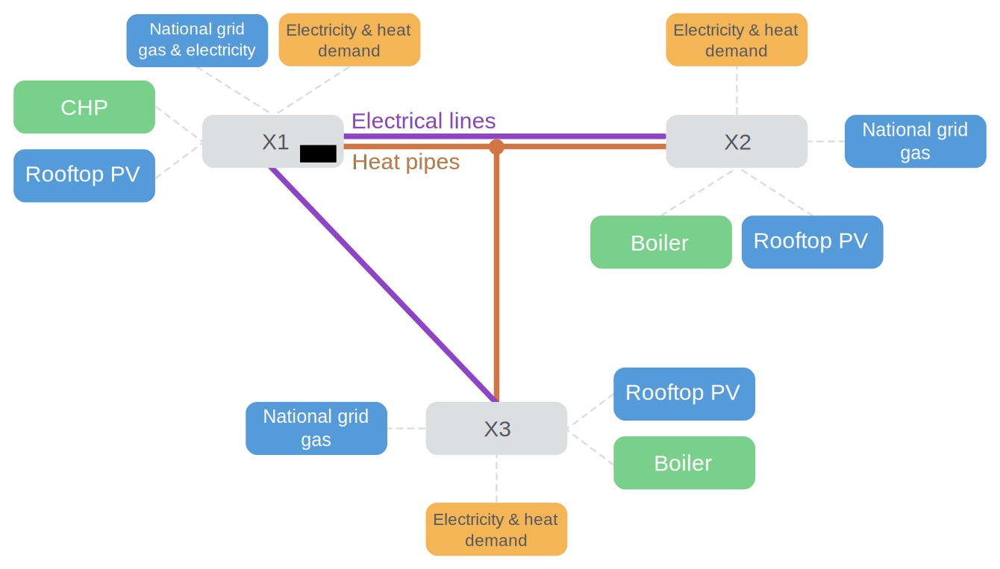
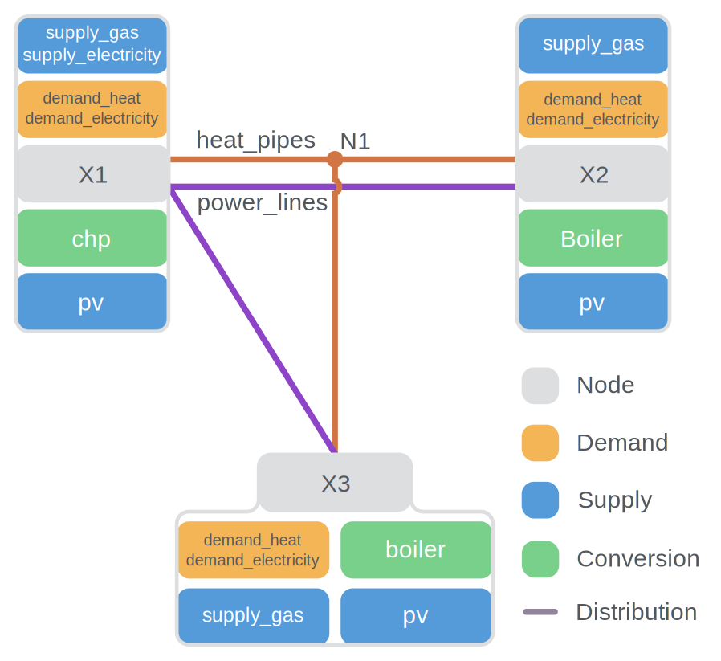

---
demand:
    file: "src/calliope/example_models/urban_scale/data_sources/demand.csv"
    header: [0, 1]
    index_col: 0
---

# Urban Scale Example Model

This example consists of two possible sources of electricity,
one possible source of heat,
and one possible source of simultaneous heat and electricity.
There are three locations, each describing a building, with transmission links between them.

The diagram below gives an overview:

<figure>

<figcaption>Urban scale example model overview</figcaption>
</figure>

We distinguish between model _configuration_ (the options provided to Calliope to do its work)
and the model _definition_ (your representation of a physical system in YAML).


## Model configuration

The model configuration file `model.yaml` is the place to tell Calliope about how to interpret the model definition and how to build and solve your model.
It does not contain much data, but the scaffolding with which to construct and run your model.

You will notice that we load a custom math file in `config.init`.
You can find out more about this custom math [below](#sparkles-interlude-custom-math)

```yaml
--8<-- "src/calliope/example_models/urban_scale/model.yaml:config"
```

### Bringing the YAML files together

Technically, you could define everything about your model in the same file as your configuration.
One file with the top-level keys `config`, `parameters`, `techs`, `nodes`, `tech_groups`, `node_groups`, `scenarios`, `overrides`.
However, this tends to become unwieldy.

Instead, various parts of the model are defined in different files and then we `import` them in the YAML file that we are going to load into calliope (`calliope.Model("my_main_model_file.yaml")`).
The import section in our file looks like this:

```yaml
--8<-- "src/calliope/example_models/urban_scale/model.yaml:import"
```

### Referencing tabular data

As of Calliope v0.7.0 it is possible to load tabular data completely separately from the YAML model definition.
To do this we reference data tables under the `data_sources` key:

```yaml
--8<-- "src/calliope/example_models/urban_scale/model.yaml:data-sources"
```

In the Calliope example models, we only load timeseries data from file, including for [energy demand](#demand-technologies), [electricity export price](#revenue-by-export) and [solar PV resource availability](#supply-technologies).
These are large tables of data that do not work well in YAML files!
As an example, the data in the energy demand CSV file looks like this:

{{ read_csv(page.meta.demand.file, header=page.meta.demand.header, index_col=page.meta.demand.index_col) }}

You'll notice that in each row there is reference to a timestep, and in each column to a technology and a node.
Therefore, we reference `timesteps` in our data source `rows` and `nodes` and `techs` in our data source columns.
Since all the data refers to the one parameter `sink_use_equals`, we don't add that information in the CSV file, but instead add it on as a dimension when loading the file.

!!! info
    You can read more about loading data from file in [our dedicated tutorial][loading-tabular-data].

## Model definition

### Indexed parameters

Before we dive into the technologies and nodes in the model, we have defined some parameters that are independent of both of these:

```yaml
--8<-- "src/calliope/example_models/urban_scale/model.yaml:parameters"
```

Neither of these parameters is strictly necessary to define.
They have defaults assigned to them (see the model definition schema in the `reference` section of the documentation).
However, we have included them in here as examples.

`objective_cost_weights` can be used to weight different cost classes in the objective function
(e.g., if we had `co2_emissions` as well as `monetary` costs).
`bigM` (https://en.wikipedia.org/wiki/Big_M_method) is used to formulate certain types of constraints and should be a large number,
but not so large that it causes numerical trouble.

`bigM` is dimensionless, while `objective_cost_weights` is indexed over the `costs` dimension.
You will see this same `parameter` definition structure elsewhere in the model definition as we index certain parameters over other dimensions.

### Supply technologies

This example model defines three supply technologies.

The first two are `supply_gas` and `supply_grid_power`, referring to the supply of `gas` (natural gas) and `electricity`, respectively, from the local distribution system.
These 'infinitely' available national commodities can become carriers in the system, with the cost of their purchase being considered at supply, not conversion.

<figure>

<figcaption>The layout of a supply technology which has an infinite source, a carrier conversion efficiency ($flow_{eff}^{out}$),
and a constraint on its maximum built $flow_{cap}$ (which puts an upper limit on $flow_{out}$).</figcaption>
</figure>

The definition of this technology in the example model's configuration looks as follows

```yaml
--8<-- "src/calliope/example_models/urban_scale/model_config/techs.yaml:supply"
```

The final supply technology is `pv` (solar photovoltaic power), which serves as an inflexible supply technology.
It has a time-varying source availability loaded from CSV, a maximum area over which it can capture its source (`area_use_max`) and a requirement that all available source is used (`source_use_equals`).
This emulates the reality of solar technologies: once installed, their production matches the availability of solar energy.

The efficiency of the DC to AC inverter (which occurs after conversion from source to carrier) is considered in `parasitic_eff`.
The `area_use_per_flow_cap` gives a link between the installed area of solar panels to the installed capacity of those panels (i.e. kWp).

In most cases, domestic PV panels are able to export excess energy to the national grid.
We allow this here by specifying `carrier_export`.
Revenue for export will be considered on a per-location basis.

The definition of this technology in the example model's configuration looks as follows:

```yaml
--8<-- "src/calliope/example_models/urban_scale/model_config/techs.yaml:pv"
```

### :sparkles: Interlude: inheriting from technology groups

You will notice that the above technologies _inherit_ `interest_rate_setter`.
Inheritance allows us to avoid excessive repetition in our model definition.
In this case, `interest_rate_setter` defines an interest rate that will be used to annualise any investment costs the technology defines.

Technologies can inherit from anything defined in `tech_groups`, while nodes can inherit from anything in `node_groups`.
items in `[tech/node]_groups` can also inherit from each other, so you can create inheritance chains.

`interest_rate_setter` looks like this:

```yaml
--8<-- "src/calliope/example_models/urban_scale/model_config/techs.yaml:interest-rate-setter"
```

### Conversion technologies

The example model defines two conversion technologies.

The first is `boiler` (natural gas boiler), which serves as an example of a simple conversion technology with one input carrier and one output carrier.
Its only constraints are the cost of built capacity (`costs.monetary.flow_cap`),
a constraint on its maximum built capacity (`constraints.flow_cap_max`),
and a carrier conversion efficiency (`flow_out_eff`).

<figure>

<figcaption>The layout of a simple conversion technology, in this case `boiler`, which has one carrier input and output, a carrier conversion efficiency ($flow_{eff}^{out}$),
and a constraint on its maximum built $flow_{cap}$ (which puts an upper limit on $flow_{out}$).</figcaption>
</figure>

The definition of this technology in the example model's configuration looks as follows:

```yaml
--8<-- "src/calliope/example_models/urban_scale/model_config/techs.yaml:boiler"
```

There are a few things to note.
First, `boiler` defines a name and a color (given as an HTML color code).
These can be used when visualising your results.
Second, it specifies its base_tech, `conversion`, its inflow carrier `gas`, and its outflow carrier `heat`, thus setting itself up as a gas to heat conversion technology.
This is followed by the definition of constraining parameters and costs;
the only cost class used is monetary but this is where other "costs", such as emissions, could be defined.

The second technology is `chp` (combined heat and power), and serves as an example of a possible conversion_plus technology making use of two output carriers.

<figure>

<figcaption>The layout of a more complex node which makes use of multiple output carriers.</figcaption>
</figure>

This definition in the example model's configuration is more verbose:

```yaml
--8<-- "src/calliope/example_models/urban_scale/model_config/techs.yaml:chp"
```

Again, `chp` has the definitions for name, color, base_tech, and carrier_in/out.
It has two carriers defined for its outflow.
Note the parameter `heat_to_power_ratio`, which we set to 0.8.
We will use this to create a link between the two output carriers.
More importantly, it is a _custom parameter_ - Calliope itself does not define `heat_to_power_ratio`
Therefore, for now, it will not have any effect - we need to introduce our own custom math.
In this case, we want to ensure that 0.8 units of heat are produced every time a unit of electricity is produced.
Furthermore, while producing these units of energy - both electricity and heat -
we want to ensure that gas consumption is only a function of electricity output.

### :sparkles: Interlude: custom math

The base Calliope math does not have the capacity to handle our `chp` technology definition from above.
By default, setting two output carriers would mean that the choice is _between_ those technologies (e.g., a heat pump that can produce heat _or_ cooling).
To ensure our `chp` will be constrained as we expect, we add custom math:

```yaml
--8<-- "src/calliope/example_models/urban_scale/custom_math.yaml"
```

There are two things we have to do:

1. Create a link between heat and electricity outflow.
They both are produced simultaneously.
We may prefer to have the heat output be set to a maximum equal to the `heat_to_power_ratio`, in which case the expression would become:
```yaml
flow_out[carriers=electricity] * heat_to_power_ratio >= flow_out[carriers=heat]
```

1. Unlink heat output from gas output.
This requires updating a constraint that already exists in the base math.
It is important that you understand the contents of the base math before you add custom math, to ensure you can override the math there appropriately.

### Demand technologies

You always need demand for your carriers in a model.
These move carriers out of the modelled system and are required for overall energy balance (energy into the system = energy out of the system).

```yaml
--8<-- "src/calliope/example_models/urban_scale/model_config/techs.yaml:demand"
```

### Transmission technologies

In this district, electricity and heat can be distributed between nodes.
Gas is made available in each node without consideration of transmission.

<figure>

<figcaption>A transmission technology with the options for flow efficiency ($flow_{eff}^{out}$ and $flow_{eff}^{in}$) and flow capacity ($flow_{cap}$).</figcaption>
</figure>

```yaml
--8<-- "src/calliope/example_models/urban_scale/model_config/techs.yaml:transmission"
```

To avoid excessive duplication in model definition, our transmission technologies inherit most of the their parameters from technology _groups_:

```yaml
--8<-- "src/calliope/example_models/urban_scale/model_config/techs.yaml:transmission-tech-groups"
```

`power_lines` has an efficiency of 0.95, so a loss during transmission of 0.05.
`heat_pipes` has a loss rate per unit distance of 2.5%/unit distance (or `flow_out_eff_per_distance` of 97.5%).
Over the distance between the two locations of 0.5km (0.5 units of distance), this translates to $2.5^{0.5}$ = 1.58% loss rate.

### Nodes

In order to translate the model requirements shown in this section's introduction into a model definition, four nodes (i.e. geographic locations) are used: `X1`, `X2`, `X3`, and `N1`.

The technologies are set up at these nodes as follows:

<figure>

<figcaption>Nodes and their technologies in the example model.</figcaption>
</figure>

Let's now look at the first location definition:

```yaml
--8<-- "src/calliope/example_models/urban_scale/model_config/locations.yaml:X1"
```

There are several things to note here:

- The node specifies a dictionary of technologies that it allows (`techs`), with each key of the dictionary referring to the name of technologies defined in our `techs.yaml` file.
Technologies listed here must have been defined elsewhere in the model configuration.
- It also overrides some options for both `demand_electricity`, `demand_heat`, and `supply_grid_power`.
For grid supply, it sets a node-specific cost.
For demands, the options set here are related to reading the demand time series from a CSV file.
CSV is a simple text-based format that stores tables by comma-separated rows.
We did not define any `sink` option in the definition of these demands.
Instead, this is done directly via a node-specific override.

- Coordinates are defined, but they will not be used for anything in the model as we have already defined the `distance` along links when we defined our transmission technologies.
Coordinates are therefore only useful for geospatial visualisations.
- An `available_area` is defined, which will limit the maximum area of all `area_use` technologies to the e.g. roof space available at our node.
In this case, we just have `pv`, but the case where solar thermal panels compete with photovoltaic panels for space, this would limit the sum of the two to the available area.

The remaining nodes look similar:

```yaml
--8<-- "src/calliope/example_models/urban_scale/model_config/locations.yaml:other-locs"
```

`X2` and `X3` are very similar to `X1`, except that they do not connect to the national electricity grid, nor do they contain the `chp` technology.
Specific `pv` cost structures are also given, emulating e.g. commercial vs. domestic feed-in tariffs.

`N1` differs to the others by virtue of containing no technologies.
It acts as a branching station for the heat network, allowing connections to one or both of `X2` and `X3` without double counting the pipeline from `X1` to `N1`:

```yaml
--8<-- "src/calliope/example_models/urban_scale/model_config/locations.yaml:N1"
```

### Revenue by export

You will have seen that both the `chp` and `pv` technologies define an export carrier (`carrier_export`).
This means they can export their produced electricity directly out of the system as well as using it to meet demands within the system.
Since export "cost" is a negative value for both technologies, they can accrue _revenue_ by exporting electricity.

The revenue from PV export varies depending on location, emulating the different feed-in tariff structures that might exist between e.g. commercial and domestic properties.
In domestic properties, the revenue is generated by simply having the installation (per kW installed capacity), as export is not metered.
Export is metered in commercial properties, thus revenue is generated directly from export (per kWh exported).
The revenue generated by CHP depends on the electricity grid wholesale price per kWh, being 80% of that.
Therefore, the export "cost" for CHP is loaded from a CSV file of time-varying values.
These revenue possibilities are reflected in the technologies' and locations' definitions.

---
!!! info "Where to go next"
    To try loading and solving the model yourself, move on to the accompanying notebook [here][running-the-urban-scale-example-model].
    You can also find a list of all the example models available in Calliope [here][calliope.examples].