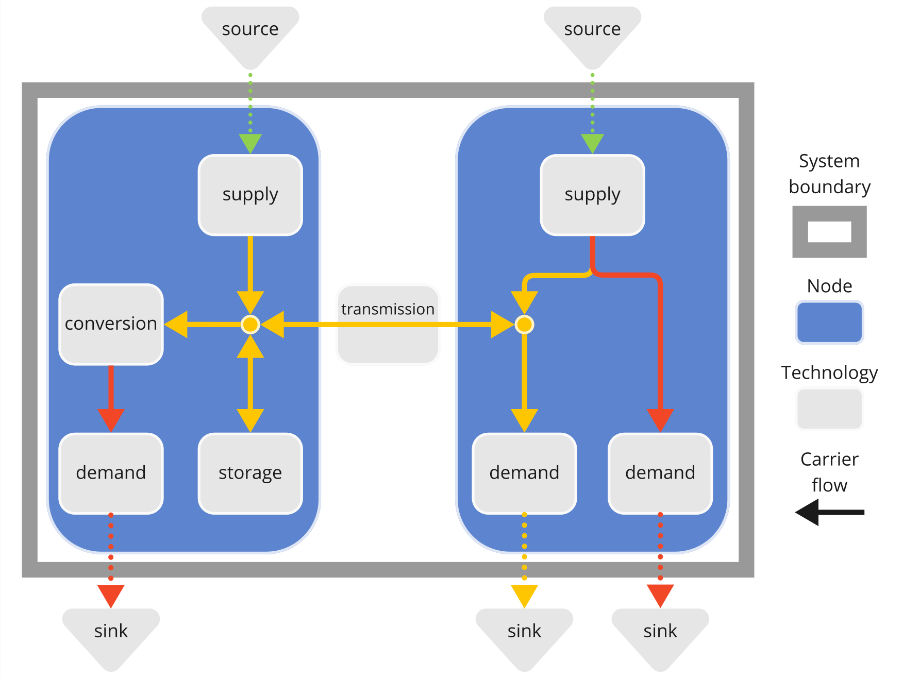

# Basic concepts

This page explains the basic concepts and ideas behind Calliope.
We then move on to describing how to [create](creating.md), [run](running.md), and [analyse](analysing.md) a Calliope model.

!!! note
    The [examples and tutorials section](../examples/overview.md) contains more hands-on examples of how to build and work with Calliope models.
    We still recommend that you first read the section you are currently looking at - "Getting started" - before going to the examples and tutorials.

## What Calliope does

Calliope is an energy system modelling framework based on mathematical optimisation.
It is designed to formulate and solve typical problems from the energy field such as:

* Capacity expansion planning
* Economic dispatch
* Power market modelling

It is used in such roles by both commercial and research organisations.
What sets Calliope apart from other tools is its focus on keeping even large models human-readable through the use of text-based model definitions, explained in more detail below.
Due to its high degree of customisability, Calliope is also particularly well suited for rapid prototyping and development.

## Mathematical modelling terminology

Some of the terminology in Calliope comes from the field of [operations research](https://en.wikipedia.org/wiki/Operations_research) (also called mathematical programming or mathematical modelling):

* **Parameters**: Numerical values which are fixed parts of the problem, i.e. user-supplied input data.
* **Variables**: Numerical values which are determined by Calliope as part of the model solving process.
* **Constraints**: Mathematical functions that define the model and give bounds to the values that the variables can take.
* **Objective function**: A mathematical function that is maximised or minimised to find values for the variables.

To dive into these concepts in more detail, you can refer to [Modelling Energy Systems](https://www.modelling-energy-systems.org/), a free online online reader based on a university course taught by one of the Calliope developers.

## Calliope terminology: how the world is represented in Calliope

A Calliope model is a collection of interconnected technologies, nodes and carriers describing a real world system of flows.
Calliope implements the mathematics for all of these, allowing you, the user, to concentrate on describing your system using the building blocks defined by Calliope.
Usually, we consider these flows to be _energy_ flows (or in the case of a power system model, _electricity_ flows).
Most of what you will read in this documentation concerns energy systems.
However, the concepts are just as applicable to other types of flows, such as water, or material goods.

These are the most important concepts around which Calliope's maths are built:

* **Carriers** are commodities whose flows we track, e.g., electricity, heat, hydrogen, water, CO<sub>2</sub>.
* **Technologies** supply, consume, convert, store or transmit _carriers_, e.g., transmission lines/pipes, batteries, power plants, wind turbines, or home appliances.
* **Nodes** contain groups of _technologies_ and are usually geographic, e.g., a country, municipality or a single house.
* Carrier flows can enter the system from **sources**, e.g., energy from the sun to power a solar panel, and can exit it into **sinks**, e.g., electricity consumed by household appliances.
Unlike _carriers_, we do not explicitly track the type of commodity described by sources and sinks.

The visual overview below gives you a sense of how a simple model might be set up.
It has two nodes (blue boxes), two carriers (yellow and red), and various technologies (grey boxes).
As we will see further below, all of these building blocks are supplied in Calliope, so all we have to do is specify how we want them to be wired together and provide data for them.



Many of the model variables (e.g. the power output from a power plant) and parameters (e.g. the demand for electricity) vary through time.
To deal with this, Calliope also has a concept of time through discrete **timesteps**.
Thus, Calliope represents space as discrete nodes and time as discrete timesteps.

Putting all of these possibilities together allows a modeller to create a model that is as simple or complex as necessary to answer a given research question.
Calliope's syntax ensures these models are intuitive, and easy to understand and share.

## Building blocks of models in Calliope

### YAML: keys and values

Models in Calliope are defined in a text file format called YAML, referring to tabular data files (in the CSV format) where necessary.
These files are essentially a collection of `key: value` entries, where `key` is a given setting - for example the nameplate capacity of a power plant - and `value` might be a number, a text string, or a list (e.g. a list of further settings).
We will often refer to "keys" and "values" in the documentation.
The keys and values can be nested, for example, to define which solver will be called to solve the problem:

```yaml
config:
  solve:
    solver: glpk
```

You will see the term "top-level key" in the documentation: that means a key at the very top of the "hierarchy" defined by this nested configuration.
In the above example, that is `config`.

Two Calliope-specific YAML extensions are important to be aware of:

* Nesting: The above example can also be written as `config.solve.solver: glpk`, where "`.`" is used to separate levels of the hierarchy of keys.
This can be used to make the YAML files more readable.
* Importing: The `import` top-level key allows you to spread your model across as many YAML files as you want.
Typically, you will have a main model file (e.g., `model.yaml`), from which you import other files.

You will see many examples of YAML as you proceed through the documentation, and most of what is happening should be intuitively understandable.
However, if you want a more detailed and systematic description of how YAML is used in Calliope, you can refer to our [YAML reference](../reference/yaml.md).

### Math: Base math, mode math, and extra math

The maths underlying a Calliope model are also defined in YAML files.
Calliope supplies built-in math and allows users to partially or fully modify and replace this math.

For example, the built-in `flow_out_max` constraint that sets the upper bound of a technology's outflow is defined like this:

```yaml
--8<-- "src/calliope/math/base.yaml:flow_out_max"
```

The default built-in math is called the **base math**.
It is called base because it is active by default.

The base math defines a [capacity planning problem][base-math] with perfect foresight.
It includes, for example, the basic concepts of carriers, nodes, and techs described above.

On top of the base math, it is possible to activate **mode math**.
This allows special cases which require additional processing, for example, the operate (dispatch / receding horizon control) and SPORES (near-optimal alternative generation) modes.

Finally, it is possible to supply **extra math** which are applied on top of the base and mode math (if used).
For instance, the [inter-cluster storage][inter-cluster-storage-math] extra math supplied with Calliope allows you to track storage levels in technologies more accurately when you are using timeseries clustering in your model.

Calliope follows a strict order of priority when applying math: **base math -> mode math -> extra math**.
Math that comes later in this order can modify and overwrite the earlier math.

### Model definition (data)

The model definition is your representation of the physical system you are modelling and includes the data with which the components specified in the math will be "populated".
It spans across the four top-level keys [`techs`](../basic/techs.md), [`nodes`](../basic/nodes.md), [`data_definitions`](../basic/data_definitions.md), and [`data_tables`](../basic/data_tables.md).

More on this will follow in the next "getting started" section, [Creating a model](creating.md).

!!! note "Note on units"
    Calliope does not ensure consistency of units across a model.
    It is the responsibility of the modeller to ensure that units are consistent.
    Our math definitions do specify a `unit` for variables and parameters, but we keep these at a generic level, for example `energy` for `flow_out` and `power` for `flow_cap`.
    These unit definitions are listed in the [math documentation](../math/built_in/index.md) and there for you to double-check the consistency of your data.

### Model configuration

The model configuration are the options provided to Calliope to do its work, and this includes specifying what maths to use.
Specifying what maths to use means specifying what kinds of model components will exist and how they will behave.
The configuration is listed under the top-level key [`config`](../basic/config.md).

Any customisation to the math used in your model is specified in the model configuration (that is, it is specified under the `config` top-level key).
This is explained in more detail in the documentation on [modes](../basic/modes.md) and [user-defined math](../user_defined_math/index.md).

Again, more on this will follow in the next "getting started" section, [Creating a model](creating.md).

### Templates, overrides, scenarios

**Templates** allow you to re-use model parts to reduce repetition and increase readability. They are under the `templates` top-level key. You can see them in use in the example models and find more details in the [YAML reference](../reference/yaml.md#reusing-definitions-through-templates).

**Overrides** and **scenarios** define alternatives to the model configuration/definition that you can refer to when you initialise your model. They are defined in the top-level YAML keys [`overrides` and `scenarios`](../basic/scenarios.md). Find more on them on the next page of the getting started guide, [Creating a model](creating.md).

## Model data structure

Once you start looking at Calliope model data from a successful model run, you will see `inputs` and `results`.

The `inputs` correspond your input data and can either be **parameters** or **lookups**.
Lookups are simply non-numeric parameters, for example, a boolean (true/false) switch used to choose between two possible constraint formulations.

The `results` correspond to variables, global expressions, or post-processed results.
They can be one of three things:

* **Variables** are defined in the math, for example, `flow_cap`, a technology's flow capacity, also known as its nominal or nameplate capacity.
* **Global expressions** are defined in the math and combine variables and parameters. For example, `cost`, the total annualised cost of a technology, is a combination of several variables and parameters.
* **Post-processed results** are calculated after a model is solved. For example, `capacity_factor` is calculated in post-processing based on the operation of all technologies, but it is _not_ a variable in the mathematical model. More detail on these are in the [postprocessing documentation](../basic/postprocessing.md).

!!! note
  All parameters, lookups, variables, and global expressions are defined in the model math
  Refer to the documentation for the [built-in base math](../math/base/index.md) and [additional built-in math](../math/built_in/index.md) for a full listing of all of them.

More on examining model results will follow later, in the section [Analysing a model](analysing.md).
