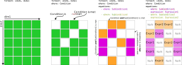

# Math syntax

This page provides an overview of the syntax available to formulate [math components](components.md).
Using the math syntax, you can populate an N-dimensional matrix with math expressions.
You use [foreach](#foreach-lists) to define the dimensions of the matrix.
You use the top-level [where string](#where-strings) to subset the matrix to only elements of interest.
You then populate the subset with any number of [equation expressions](#equations), each further subsetting the matrix.



!!! info "See also"

    Reference for the allowed key-value pairs in your additional math YAML file is available in the [reference section of the documentation][math-formulation-schema].

## foreach lists

If the math component is indexed over dimensions (a.k.a. "sets" - e.g., `techs`, `nodes`, `timesteps`), then you need to define a `foreach` list of those sets.
If the component is dimensionless, no `foreach` list needs to be defined.

For example, `#!yaml foreach: [nodes, techs]` will build the component over all `nodes` and `techs` in the model.

The available dimensions in Calliope are: `nodes`, `techs`, `carriers`, `costs`, `timesteps`.
If using [time clustering](../advanced/time.md#time-clustering) and [inter-cluster storage math][inter-cluster-storage-math], there is also a `datesteps` set available.
If you want to build over your own custom dimension, you will need to add it to the Calliope model dataset before building the optimisation problem, e.g. as a new indexed parameter.

## where strings

`Where` strings allow you to define math that applies to only a subset of your data or of the models you are running.
They are made up of a series of statements combined with logical operators.
These statements can be one of the following:

1. Checking the existence of set items in an input parameter.
When checking the existence of an input parameter it is possible to first sum it over one or more of its dimensions; if at least one value on the summed dimension(s) is defined, then it will be considered defined in the remaining dimensions.

    ??? example annotate "Examples"

        - If you want to apply a constraint across all `nodes` and `techs`, but only for node+tech combinations where the `flow_out_eff` parameter has been defined, you would include `flow_out_eff`.
        - If you want to apply a constraint over `techs` and `timesteps`, but only for combinations where the `source_use_max` parameter has at least one `node` with a value defined, you would include `any(resource, over=nodes)`.  (1)

    1.  `any` is a [helper function](#helper-functions); read more below!

1. Checking the value of a configuration option or an input parameter.
Checks can use any of the operators: `>`, `<`, `=`, `<=`, `>=`.
Configuration options are any that are defined in `config.build`, where you can define your own options to access in the `where` string.

    ??? example annotate "Examples"

        - If you want to apply a constraint only if the configuration option `config.build.mode` is _operate_, you would include `config.mode=operate`.
        - If you want to apply a constraint across all `nodes` and `techs`, but only where the `flow_eff` parameter is less than 0.5, you would include `flow_eff<0.5`.
        - If you want to apply a constraint only for the first timestep in your timeseries, you would include `timesteps=get_val_at_index(dim=timesteps, idx=0)`. (1)
        - If you want to apply a constraint only for the last timestep in your timeseries, you would include `timesteps=get_val_at_index(dim=timesteps, idx=-1)`.

    1.  `get_val_at_index` is a [helper function](#helper-functions); read more below!

1. Checking the `base_tech` of a technology (`storage`, `supply`, etc.) or its inheritance chain (if using `templates` and the `template` parameter).

    ??? example "Examples"

        - If you want to create a decision variable across only `storage` technologies, you would include `base_tech=storage`.
        - If you want to apply a constraint across only your own `rooftop_supply` technologies (e.g., you have defined `rooftop_supply` in `templates` and your technologies `pv` and `solar_thermal` define `#!yaml template: rooftop_supply`), you would include `inheritance(rooftop_supply)`.
        Note that `base_tech=...` is a simple check for the given value of `base_tech`, while `inheritance()` is a helper function ([see below](#helper-functions)) which can deal with finding techs/nodes using the same template, e.g. `pv` might inherit the `rooftop_supply` template which in turn might inherit the template `electricity_supply`.

1. Subsetting a set.
The sets available to subset are always [`nodes`, `techs`, `carriers`] + any additional sets defined by you in [`foreach`](#foreach-lists).

    ??? example annotate "Examples"

        - If you want to filter `nodes` where any of a set of `techs` are defined: `defined(techs=[tech1, tech2], within=nodes, how=any)` (1).

    1. `defined` is a [helper function](#helper-functions); read more below!

To combine statements you can use the operators `and`/`or`.
You can also use the `not` operator to negate any of the statements.
These operators are case insensitive, so "and", "And", "AND" are equivalent.
You can group statements together using the `()` brackets.
These statements will be combined first.

??? example "Examples"

    - If you want to apply a constraint for `storage` technologies if the configuration option `cyclic_storage` is activated and it is the last timestep of the series: `base_tech=storage and cyclic_storage=True and timesteps=get_val_at_index(dim=timesteps, idx=-1)`.
    - If you want to create a decision variable for the input carriers of conversion technologies: `carrier_in and base_tech=conversion`
    - If you want to apply a constraint if the parameter `source_unit` is `energy_per_area` or the parameter `area_use_per_flow_cap` is defined: `source_unit=energy_per_area or area_use_per_flow_cap`.
    - If you want to apply a constraint if the parameter `flow_out_eff` is less than or equal to 0.5 and `source_use` has been defined, or `flow_out_eff` is greater than 0.9 and `source_use` has not been defined: `(flow_out_eff<=0.5 and source_use) or (flow_out_eff>0.9 and not source_use)`.

Combining `foreach` and `where` will create an n-dimensional boolean array.
Wherever index items in this array are _True_, your component `expression(s)` will be applied.

## expression strings

As with where strings, expression strings are a series of math terms combined with operators.
The terms can be input parameters, decision variables, global expressions, or numeric values that you define on-the-fly.

If you are defining a `global expression` or `objective`, then the available expression string operators are: `+`, `-`, `*`, `/`, and `**` ("to the power of").
These expressions are applied using standard operator precedence (BODMAS/PEMDAS, see [this wiki](https://en.wikipedia.org/wiki/Order_of_operations) for more info).

If you are defining a `constraint`, then you also need to define a comparison operator: `<=`, `>=`, or `==`.

??? example "Examples"

    - If you want to limit all technology outflow to be less than 200 units: `flow_out <= 200`.
    - If you want to create a global expression which is the storage level minus a parameter defining a minimum allowed storage level: `storage - storage_cap * min_storage_level`.
    - If you want to set the outflow of a specific technology `my_tech` to equal all outflows of a specific carrier `my_carrier` at each node: `flow_out[techs=my_tech] == sum(flow_out[carriers=my_carrier], over=techs)`.
    - If you want inflows at a node `my_node` to be at least as much as the inflows in the previous timestep: `flow_in[nodes=my_node] >= roll(flow_in[nodes=my_node], timesteps=1)`.

### Slicing data

You do not need to define the sets of math components in expressions, unless you are actively "slicing" them.
Behind the scenes, we will make sure that every relevant element of the defined `foreach` sets are matched together when applying the expression (we [merge the underlying xarray DataArrays](https://docs.xarray.dev/en/stable/user-guide/combining.html)).
Slicing math components involves appending the component with square brackets that contain the slices, e.g. `flow_out[carriers=electricity, nodes=[A, B]]` will slice the `flow_out` decision variable to focus on `electricity` in its `carriers` dimension and only has two nodes (`A` and `B`) on its `nodes` dimension.
To find out what dimensions you can slice a component on, see your input data (`model.inputs`) for parameters and the definition for decision variables in your loaded math dictionary (`model.math.variables`).

## Helper functions

For [`where` strings](#where-strings) and [`expression` strings](#where-strings), there are many helper functions available to use, to allow for more complex operations to be undertaken.
Their functionality is detailed in the [helper function API page](../reference/api/helper_functions.md).
Here, we give a brief summary.
Some of these helper functions require a good understanding of their functionality to apply, so make sure you are comfortable with them before using them.

### inheritance

using `inheritance(...)` in a `where` string allows you to grab a subset of technologies / nodes that all share the same [`template`](../creating/templates.md) in the technology's / node's `template` key.
If a `template` also inherits from another `template` (chained inheritance), you will get all `techs`/`nodes` that are children along that inheritance chain.

So, for the definition:

```yaml
templates:
  techgroup1:
    template: techgroup2
    flow_cap_max: 10
  techgroup2:
    base_tech: supply
techs:
  tech1:
    template: techgroup1
  tech2:
    template: techgroup2
```

`inheritance(techgroup1)` will give the `[tech1]` subset and `inheritance(techgroup2)` will give the `[tech1, tech2]` subset.

### any

Parameters are indexed over multiple dimensions.
Using `any(..., over=...)` in a `where` string allows you to check if there is at least one non-NaN value in a given dimension (akin to [xarray.DataArray.any][]).
So, `any(cost, over=[nodes, techs])` will check if there is at least one non-NaN tech+node value in the `costs` dimension (the other dimension that the `cost` decision variable is indexed over).

### defined

Similar to [any](#any), using `defined(..., within=...)` in a `where` string allows you to check for non-NaN values along dimensions.
In the case of `defined`, you can check if e.g., certain technologies have been defined within the nodes or certain carriers are defined within a group of techs or nodes.

So, for the definition:

```yaml
techs:
  tech1:
    base_tech: conversion
    carrier_in: electricity
    carrier_out: heat
  tech2:
    base_tech: conversion
    carrier_in: [coal, biofuel]
    carrier_out: electricity
nodes:
  node1:
    techs: {tech1}
  node2:
    techs: {tech1, tech2}
```

`defined(carriers=electricity, within=techs)` would yield a list of `[True, True]` as both technologies define electricity.

`defined(techs=[tech1, tech2], within=nodes)` would yield a list of `[True, True]` as both nodes define _at least one_ of `tech1` or `tech2`.

`defined(techs=[tech1, tech2], within=nodes, how=all)` would yield a list of `[False, True]` as only `node2` defines _both_ `tech1` and `tech2`.

### sum

Using `sum(..., over=)` in an expression allows you to sum over one or more dimension of your component array (be it a parameter, decision variable, or global expression).

### select_from_lookup_arrays

Some of our arrays in [`model.inputs`][calliope.Model.inputs] are not data arrays, but "lookup" arrays.
These arrays are used to map the array's index items to other index items.
For instance when using [time clustering](../advanced/time.md#time-clustering), the `lookup_cluster_last_timestep` array is used to get the timestep resolution and the stored energy for the last timestep in each cluster.
Using `select_from_lookup_arrays(..., dim_name=lookup_array)` allows you to apply this lookup array to your data array.

### get_val_at_index

If you want to access an integer index in your dimension, use `get_val_at_index(dim_name=integer_index)`.
For example, `get_val_at_index(timesteps=0)` will get the first timestep in your timeseries, `get_val_at_index(timesteps=-1)` will get the final timestep.
This is mostly used when conditionally applying a different expression in the first / final timestep of the timeseries.

It can be used in the `where` string (e.g., `timesteps=get_val_at_index(timesteps=0)` to mask all other timesteps) and the `expression string` (via [slices](#slices) - `storage[timesteps=$first_timestep]` and `first_timestep` expression being `get_val_at_index(timesteps=0)`).

### roll

We do not use for-loops in our math.
This can be difficult to get your head around initially, but it means that to define expressions of the form `var[t] == var[t-1] + param[t]` requires shifting all the data in your component array by N places.
Using `roll(..., dimension_name=N)` allows you to do this.
For example, `roll(storage, timesteps=1)` will shift all the storage decision variable objects by one timestep in the array.
Then, `storage == roll(storage, timesteps=1) + 1` is equivalent to applying `storage[t] == storage[t - 1] + 1` in a for-loop.

### default_if_empty

We work with quite sparse arrays in our models.
So, although your arrays are indexed over e.g., `nodes`, `techs` and `carriers`, a decision variable or parameter might only have one or two values in the array, with the rest being NaN.
This can play havoc with defining math, with `nan` values making their way into your optimisation problem and then killing the solver or the solver interface.
Using `default_if_empty(..., default=...)` in your `expression` string allows you to put a placeholder value in, which will be used if the math expression unavoidably _needs_ a value.
Usually you shouldn't need to use this, as your `where` string will mask those NaN values.
But if you're having trouble setting up your math, it is a useful function to getting it over the line.

!!! note
    Our internally defined parameters, listed in the `Parameters` section of our [pre-defined base math documentation][base-math] all have default values which propagate to the math.
    You only need to use `default_if_empty` for decision variables and global expressions, and for user-defined parameters.

## equations

Equations are combinations of [expression strings](#expression-strings) and [where strings](#where-strings).
You define one or more equations for your model components.
A different `where` string associated with each equation expression allows you to slightly alter the expression for different component members.
You define equations as lists of dictionaries:

``` yaml
equations:
  - where: ...
    expression: ...
  - where: ...
    expression: ...
```

If you are supplying only one equation, you do not need to define a `where` string:

```yaml
equations:
  - expression: ...
```

!!! note

    `where` strings within equations are appended to your top-level `where` string, e.g.:

    ```yaml
    where: storage_cap_max
    equations:
      - where: flow_in_eff > 0.5  # <- this will be parsed as "storage_cap_max and flow_in_eff > 0.5"
      expression: ...
      - where: flow_in_eff <= 0.5  # <- this will be parsed as "storage_cap_max and flow_in_eff <= 0.5"
      expression: ...
    ```

??? example "Examples"

    - Divide by efficiency if efficiency is larger than zero, otherwise set the variable to zero:

    ```yaml
    equations:
      - where: flow_eff > 0
        expression: flow_out / flow_out_eff == flow_in
      - where: flow_eff = 0
        expression: flow_out == 0
    ```

    - Limit flow by storage_cap, if it is defined, otherwise by flow_cap:

    ```yaml
    equations:
      - where: storage_cap
        expression: flow_out <= 0.5 * storage_cap
      - where: not storage_cap
        expression: flow_out <= 0.9 * flow_cap
    ```

!!! warning

    You have to be careful when setting up different `where` strings to avoid clashes, where different expressions are valid for the same component member.
    We will raise errors when this happens, and if your `where` strings become too restrictive and so miss a component member that needs an expression.

## sub-expressions

For long expressions - or those where a part of the expression might change for different component members according to a specific condition - you can define sub-expressions.
These look similar to equations; they are lists of dictionaries with `where` and `expression` strings.
They are accessed from you main expression(s) by reference to their name prepended with the special `$` character.
For example:

```yaml
equations:
  - expression: flow_out <= $adjusted_flow_in
sub_expressions:
  adjusted_flow_in:
    - where: inheritance(storage)
      # main expression becomes `flow_out <= flow_in * flow_eff`
      expression: flow_in * flow_eff
    - where: inheritance(supply)
      # main expression becomes `flow_out <= flow_in * flow_eff * parasitic_eff`
      expression: flow_in * flow_eff * parasitic_eff
    - where: inheritance(conversion)
      # main expression becomes `flow_out <= flow_in * flow_eff * 0.3`
      expression: flow_in * flow_eff * 0.3
```

!!! note

    As with [equations](#equations), `where` strings are mixed in together.
    If you have two equation expressions and three sub-expressions, each with two expressions, you will end up with 2 * 3 * 2 = 12 unique `where` strings with linked `expression` strings.

## slices

Similarly to [sub-expressions](#sub-expressions), you can use references when [slicing your data](#slicing-data), again using the `$` identifier.
Standard slicing only allows for dimensions to reference plain strings or lists of plain strings.
If you want to slice using a "lookup" parameter, you will need to provide it within the `slices` sub-key, e.g.:

If you define a lookup parameter "lookup_techs" as:

```yaml
parameters:
  lookup_techs:
    data: True
    index: [tech_1, tech_2]
    dims: [techs]
```

Then the following slice will select only the `tech_1` and `tech_2` members of `flow_out`:

```yaml
equations:
  - expression: sum(flow_out[carriers=electricity, techs=$tech_ref]) <= flow_in[carriers=heat] * 0.6
slices:
  tech_ref:
    - expression: lookup_techs
```

## default

Variables and global expressions can take `default` values.
These values will be used to fill empty array elements (i.e., those that are not captured in the [`where` string](#where-strings)) when conducting math operations.
A default value is not _required_, but is a useful way to ensure you do not accidentally find yourself with empty array elements creeping into the constraints.
These manifest as `NaN` values in the optimisation problem, which will cause an error when the problem is sent to the solver.
